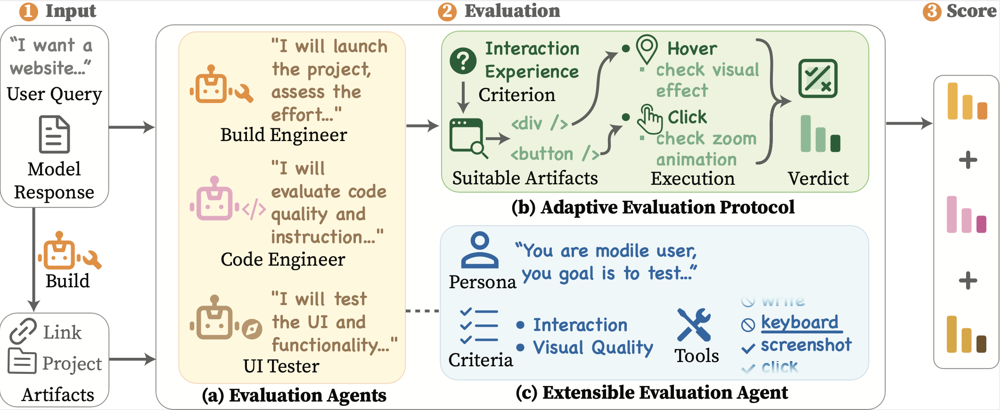

<!-- Improved compatibility of back to top link: See: https://github.com/othneildrew/Best-README-Template/pull/73 -->
<a id="readme-top"></a>

<br />
<div align="center">

  <h1>LiveEvalBench: Toward Open-World Evaluation for Web Generation</h1>

  <p align="center">
    
  </p>

  <p>
    <a href="#getting-started">Getting Started</a>
    &nbsp;•&nbsp; <a href="#usage">Usage</a>
    &nbsp;•&nbsp; <a href="#data-format">Data Format</a>
    &nbsp;•&nbsp; <a href="#configuration">Configuration</a>
    &nbsp;•&nbsp; <a href="#bibtex">BibTeX</a>
  </p>

  <p align="center">
  Large language models are increasingly capable of synthesizing executable frontend projects, yet existing benchmarks still treat web generation as a static evaluation problem. We argue that frontend artifacts demand a different paradigm: they are interactive rather than static, admit diverse yet equally valid implementations, and evolve faster than rigid pipelines can accommodate. To address these gaps, we present LiveEvalBench, an automated framework that reformulates web-generation evaluation as an agentic, adaptive, and extensible process. LiveEvalBench instantiates evaluation as a collaborative review workflow, in which a Build Engineer, a Code Engineer, and a UI Tester collectively gather evidence across the full lifecycle of a frontend project, from deployment and code inspection to browser-based interaction. To handle implementation diversity, an adaptive protocol couples shared rubrics for cross-model comparability with implementation-grounded criteria tailored to each artifact. The framework further supports incremental integration of new evaluator roles and assessment dimensions without pipeline redesign. Experiments across diverse real-world web-generation scenarios show that LiveEvalBench aligns closely with human expert judgment and provides fine-grained insights into frontier models' web generation capabilities.
  </p>
</div>


<details>
  <summary>Table of Contents</summary>
  <ol>
    <li><a href="#about">About</a></li>
    <li><a href="#getting-started">Getting Started</a>
      <ul>
        <li><a href="#prerequisites">Prerequisites</a></li>
        <li><a href="#installation">Installation</a></li>
      </ul>
    </li>
    <li><a href="#usage">Usage</a></li>
    <li><a href="#data-format">Data Format</a></li>
    <li><a href="#configuration">Configuration</a></li>
    <li><a href="#project-structure">Project Structure</a></li>
    <li><a href="#bibtex">BibTeX</a></li>
    <li><a href="#contact">Contact</a></li>
  </ol>
</details>

## About

LiveEvalBench is a comprehensive and extensible evaluation framework for web generation, where models generate complete executable frontend projects from natural-language user requests. It is designed to provide more complete evaluation of generated web projects and more flexible extensibility for future evaluation needs. By using specialized evaluator agents to run, inspect, and interact with generated projects, LiveEvalBench evaluates model-built frontends through evidence collected from the actual project workflow.

Here's what makes LiveEvalBench special:

- <b>🔍 Comprehensive Project Evaluation</b>: Evaluates generated frontend projects as runnable web projects, with evidence collected across build, code, and browser interaction to provide a fuller picture of project quality.

- <b>🛠️ Agent-Based Evaluation Workflow</b>: Employs specialized evaluator agents, including a Build Engineer, Code Engineer, and UI Tester, to actively collect complementary evidence from runtime behavior, source implementation, and user interaction.

- <b>🌐 Extensible Evaluator Design</b>: Allows new evaluator roles, assessment dimensions, and tool capabilities to be added through configuration, making the agent-based workflow easy to extend as web generation tasks evolve.

- <b>🧪 Adaptive Evaluation Protocol</b>: Handles the diversity of web generation by comparing models under shared evaluation goals while adapting concrete checks to what each generated project actually implements.

Compared to existing approaches, LiveEvalBench offers:

- More complete evaluation of generated frontend projects through build, code, and browser-interaction evidence
- Flexible extension to new evaluator roles, criteria, and tools
- Adaptive scoring that supports comparison across diverse implementations for the same user request

We welcome suggestions and contributions! Feel free to fork the repo, create a pull request, or open an issue.

<p align="right">(<a href="#readme-top">back to top</a>)</p>

## Getting Started

### Prerequisites

- Python 3.10+
- Node.js 22+ (required by vitest/rolldown for `util.styleText`)
- [uv](https://github.com/astral-sh/uv) (recommended) or pip
- An LLM API key (Anthropic, OpenAI, Google, or any OpenAI-compatible provider)

### Installation

```bash
# Clone
git clone https://github.com/wyysteelhead/LiveEvalBench.git
cd LiveEvalBench

# Install Python dependencies
uv sync            # or: pip install -e .

# Install the Playwright Chromium driver (local execution)
playwright install chromium

# Configure environment
cp .env.example .env
# Edit .env — at minimum set MODEL_PROVIDER, MODEL_NAME, VISION_MODEL_NAME,
# and the API key for your provider. See the [REQUIRED] section of .env.example.
```

> Tip: a guided first-time setup (env install + `.env` + dataset + smoke test) is available as the `livebench-setup` skill (in `.claude/skills/`), and auto-running the benchmark is the `livebench-run` skill.

<p align="right">(<a href="#readme-top">back to top</a>)</p>

## Usage

### 0. Get the benchmark dataset

The benchmark dataset is already downloaded.

### 1. Run the evaluation

```bash
python scripts/eval_open.py --jsonl benchmark.jsonl --output runs/report.json --chunk-size 10
```

Useful flags:

| Flag | Description |
|------|-------------|
| `--jsonl PATH` | Input JSONL file (required) |
| `--output PATH` | Output report file (shards written under `{output}.shards/`) |
| `--max-parallel N` | Maximum parallel evaluations (default from `MAX_PARALLEL`) |
| `--chunk-size N` | Rotate shard files every N rows (recommended for large runs) |
| `--shard N --shard-count M` | Multi-process sharding |
| `--no-resume` | Start fresh, ignore existing output (default: resume on) |
| `--rerun-nonpassed` | Re-run failed/inconclusive rows on resume |
| `--monitor-state PATH` | Write live monitor state JSON |
| `--log-file PATH` | Log file path |
| `--agents-dir DIR` | Agent config directory (default: `agents`) |

### 2. Monitor & view results

```bash
# Live monitor while eval_open.py is running
python scripts/visualization/eval_open_monitor.py --state runs/monitor.json

# Merge shards into a single report
python scripts/tools/merge_shards.py runs/report.shards/ --output runs/report.merged.jsonl --stats

# Web dashboard to browse results
python scripts/visualization/eval_open_web.py   # see --help for the report path flag
```

<p align="right">(<a href="#readme-top">back to top</a>)</p>

## Data Format

The evaluation input is a JSONL file. Each line is a JSON object with:

| Field | Type | Description |
|-------|------|-------------|
| `id` | number/string | Unique row identifier |
| `query` | string | The original user prompt given to the LLM |
| `code` | string | The LLM-generated code output (Markdown with code blocks) |
| `ext_info` | object | Optional metadata (e.g. `model_name`, trace IDs) |

Example:
```json
{"id": 1, "query": "Build a counter app with increment and decrement buttons", "code": "# Counter App\n\n```tsx\n// filename: app/page.tsx\n...\n```", "ext_info": {"model_name": "claude-sonnet-4-5"}}
```

<p align="right">(<a href="#readme-top">back to top</a>)</p>

## Configuration

All configuration is via environment variables in `.env` (copy from `.env.example`). Only the **[REQUIRED]** section must be set; everything else has defaults.

**Required:** `MODEL_PROVIDER`, `MODEL_NAME`, `VISION_MODEL_NAME`, the matching API key, and `EXECUTOR_BACKEND=playwright`.

Key tunables (see `.env.example` for the full list):

| Variable | Description | Default |
|----------|-------------|---------|
| `MODEL_PROVIDER` | `anthropic` / `openai` / `google` / `custom` | `custom` |
| `MODEL_NAME` / `VISION_MODEL_NAME` | Judge / perception model ids | — |
| `EXECUTOR_BACKEND` | Browser backend (local) | `playwright` |
| `MAX_AGENT_STEPS` | ReAct iterations per agent | `80` |
| `ROW_PARALLELISM` | Concurrent rows | `4` |
| `BUILD_PARALLELISM` | Concurrent build phases | `4` |
| `LLM_CALLS_PER_SECOND` | LLM rate limit (token bucket) | `20` |
| `CHUNK_SIZE` | Shard rotation size | `10` |
| `ROW_TIMEOUT` | Per-row wall-clock cap (s) | `5400` |

<p align="right">(<a href="#readme-top">back to top</a>)</p>

## Project Structure

```
LiveEvalBench/
├── scripts/
│   ├── eval_open.py                 # Main evaluation entry point
│   ├── tools/
│   │   └── merge_shards.py          # Merge chunk shard files → single report
│   └── visualization/
│       ├── eval_open_monitor.py     # Live runtime monitor
│       └── eval_open_web.py         # Web dashboard for browsing results
├── agents/                          # Agent JSON configs (4 core roles)
│   ├── build_engineer.json
│   ├── build_reviewer.json
│   ├── code_tester.json
│   └── ui_tester.json
├── configs/                         # Prompt / rubric / scoring templates
├── src/frontend_evaluator/          # Core library
│   ├── agent/                       # Agent runtime (ReAct orchestration)
│   ├── cli_support/                 # CLI helpers (JSONL, resume, checkpoints)
│   ├── llm/                         # LLM provider abstraction
│   ├── parser/                      # Markdown → code-file extraction
│   ├── planner/                     # Task planning / query-specific synthesis
│   ├── sandbox/                     # Local Playwright/CDP execution
│   ├── tools/                       # Agent tools (browser, file, build)
│   └── utils/                       # Config, logging
├── docs/                            # Output schemas (artifacts/manifest) + tools API reference
├── .env.example                     # Environment variable template
├── pyproject.toml                   # Python project metadata
└── requirements.txt
```


<p align="right">(<a href="#readme-top">back to top</a>)</p>

## License

MIT License — see `LICENSE` for details.
